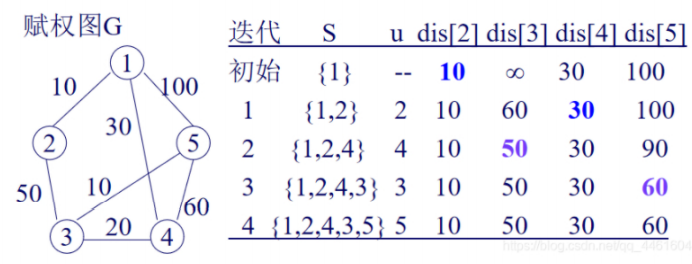

# 算法设计与分析

## 递归(纯递归算法$O(2^k)$)
* 时间复杂度： $O(2^k)$；实际上是生成树或遍历树的过程
* 定义：程序直接或间接的调用自己。
* 优点： 结构清晰，易读易证。
* 缺点：时间效率低，空间开销大，不容易优化。

### 二分查找

```c++
int bsearch(int b[], int x, int L, int R) 
{
	int mid;

	if(L>R) return -1;
	mid = (L+R) / 2;
	if(x == b[mid])
		return mid;
	else if(x<b[mid])
		return bsearch(b,x,L,mid-1);
	else
		return bsearch(b,x,mid+1,R);
}
```

### 阶乘

```c++
int fact(int n)
{
	if(n==1) return 1;
	else return n*fact(n-1);
}
```

### 斐波那契

```c++
long Fib(int n)
{
	if(n==0||n==1) return n;
	else return Fib(n-1) + Fib(n-2);
}
```

### 汉诺塔

```c++

/**
 *   | |   | |   | |
 *   | |   | |   | |
 *    A     B     C
 */
void Hanoi(int n, char a, char b, char c) 
{
	if(n==1) cout<<"将第"<<n<<"个盘片从"<<a<<"移动到"<<c<<endl;
	else
	{
		Hanoi(n-1,a,c,b);// 把n-1个盘片从A借助C移动至B
		cout<<"将第"<<n<<"个盘片从"<<a<<"移动到"<<c<<endl;
		Hanoi(n-1,b,a,c);// 把n-1盘片从B借助A移动到C
	}
}
```

### 求顺序表中的最大值

```c++
int getMax(int L[], int i, int j)
{
	int mid;
	int max, max1, max2;
	if(i==j)
		max = L[i];
	else 
	{
		mid = (i+j) /2;
		max1 = getMax(L,i,mid);
		max2 = getMax(L,mid+1,j);
		max = (max1>max2)?max1:max2;
	}
	return max;
}
```

### 辗转相除法

```c++
int gcd(int m, int n)
{
	if(n==0) return m;
	else return gcd(n, m % n);
}
```

### 快速排序$O(nlogn)->O(n^2)$

```c++
void quickSort(int a[], int left, int right)
{
	int i,j,t,temp;
	if(left>right)
		return ; //不符合

	temp = a[left];
	i = left;
	j = right;

	while(i!=j)
	{
		while(a[j]>=temp && i<j)
			j--;
		while(a[i]<=temp && i<j)
			i++;

		if(i<j)
		{
			t=a[i];
			a[i]=a[j];
			a[j]=t;
		}
	}

	a[left] = a[i];
	a[i] = temp;

	quickSort(a,left,i-1);
	quickSort(a,i+1,right);
}
```

## 分治

将问题分解成为小的问题，然后小问题的解合并起来成为大问题的解。

1. 缩小规模可以解决问题
2. 具有最优子结构
3. 子问题解可以合并
4. 子问题相互独立

```c++
// logn
int bsearch(int b[], int x, int L, int R) 
{
	int left = 0;
	int right = n - 1;
	while(left<=right)
	{
		int mid = (left + right) /2;
		if(x==b[mid]) return mid;
		else if (x>b[mid]) left = mid + 1; //这里就和递归方法有所不同了
		else right = mid - 1;
	}
	return -1; //未找到
}
```

### 归并$O(nlogn)$

```c++
void MergeSort(int a[], int left, int right)
{
	if(left<right)
	{
		int mid = (left+right) /2;
		MergeSort(a, left, mid); //对左边排序
		MergeSort(a, mid+1, right); //对右边界排序
		merge(a,b,left,mid+1,right); //合并元素到数组b
		copy(a,b,left,right); //复制回数组a
	}
}

//对于其中归并函数进行解读
void merge(int a[], int b[], int left, int right, int rightEnd)
{
	int leftEnd = right - 1;
	int temp = left;
	int n = rightEnd - left + 1;

	//归并开始
	while(left<=leftEnd && R<=rightEnd)
	{
		if(a[left]<=a[right])
			b[temp++] = a[left++];
		else
			b[temp++] = a[right++];
	}

	//多余部分
	while(left<=leftEnd)
		tempA[temp++] = a[left++];
	while(right<=rightEnd)
		tempA[temp++] = a[right++];;

	for(int i=0;i<n;i++,rightEnd--) {
		A[rightEnd] = temp[rightEnd];
	}
}
```

## 贪心策略

### 活动安排问题$O(n)$
早完成的活动先安排
```c++
void greatSelector(int n, int s[], int f[], bool a[])
{
	//注意：活动按照结束的时间的顺序排序
	a[1] = true; 
	int j = 1;
	for(int i=2;i<=n;i++)
	{
		if(s[i]>f[j])
		{
			a[i] = true;
			j = i;
		} else a[i] = false;
	}
}
```

### 背包问题$O(nlogn)$

非0-1背包问题：**0-1背包问题不能使用贪心算法**

注意区分：0-1背包的物体不能够切分，而背包问题可以只装入物体的一部分

时间复杂度上界$O(nlogn)$，其实就是对元素排序的部分

```c++
//思路是：计算各个物体的单位质量的价值：v/w，然后排序后装入
void Knapsack(int n, float M, float v[], float w[], float x[])
{
	//1. 计算各个物体的单位质量的价值：v/w，并排序
	Sort(n,v,w); // O(nlogn)

	int i;
	for(i=1; i<=n; i++) x[i] = 0; //初始化

	float c = M; //初始背包容量

	//2. 循环转入物体，如果装满了就退
	for(i=1; i<=n; i++)
	{
		if(w[i] > c) break;
		x[i] = 1;
		c -= w[i];
	}
	//3. 进一步判断是否有剩余
	if(i<=n) x[i] = c / w[i];
}
```

### 最优装载问题$O(nlogn)$

x表示是否装入，w代表重量，c代表轮船当前的容量，n代表集装箱数目
```c++
void Loading(int x[], int w[], int c, int n)
{
	int *t = new int[n+1];

	//将集装箱按照其重量的从小到大的顺序排序，并不改变原来的w数组，而是将排序的结果存入t数组中
	Sort(w,t,n);

	//初始化
	for(int i=1; i<=n;i++) x[i] = 0;
	for(int i=1; i<=n && w[t[i]]<=c;i++)
	{
		x[t[i]] = 1;
		c -= w[t[i]];
	}
}
```

### 多机调度问题$O(nlogn)$

各个独立不可拆分作业，由机器加工处理，各个作业处理时间一直，每个作业都可以在一台机器上加工处理但是不可中断。

调度方案：所给的n个作业在尽可能短的时间由m机器加工完成

1. **排序**作业，将作业按照时间从大到小排序
2. 选择完成时间最早的机器不断放入

注意：不一定得到最优解，因为此问题不具有贪心选择性质和最有结构


### 旅行商人问题$O(n^k)$

无向网，各个边的权值为路径长度
已知：连接矩阵w[][],连接的城市path[],p记录当前到达的城市，cost记录当前的路径长度，arrived[]记录城市是否到达

```c++
int tray_greedy(int n, int **w, int *path)
{
	//初始化
	for(int i=1;i<=n;i++) {
		arrived[i] = false;
		cost = 0;
	}

	//1. 从结点1出发
	path[1] = 1;
	p = 1;
	arrived[1] = true;

	//遍历路径
	int min;
	for(int i=2;i<=n;i++)
	{
		min = inf;//最小值初始化
		for(int j=1;j<=n;j++)
		{
			//3. 搜索到，如果没有去过，同时此时的路径最小
			if(!arrived[j]&&w[p][j]<min)
			{
				//选择为路径
				k=j;
				min = w[p][j];
			}
		}

		cost += w[p][k];
		path[i] = k;
		arrived[k] = true;
		p = k;
	}
	cost += w[p][1]; // 最后构成回路
	return cost;
}
```

### 最小生成树

#### Prim $O(n^2)$
从一个点出发，找最短的长度的边，找到后加入新的点，在新的点基础上继续寻找，每一次寻找不能形成环，最终所有点加入并构成树。O(n^2)两层循环

#### Kruskal $O(nlogn)$
将权重从小到大排序（主要耗费的空间复杂度），不断找最短的边，每一次寻找不能形成环，最终所有点加入并构成树。O(nlogn)

### 单源最短路径$O(n^2)$
dijistra算法具体过程，算法复杂度$O(n^2)$，外层循环n次，内存俩次循环。


### 哈夫曼编码$O(nlogn)$
将新的或者旧的路径长度从小到大**排序**，并两两组合成新的值。最终构成一棵二叉树

算法复杂度为$O(nlogn)$

## 动态规划

基本要素：最优子结构和重叠子问题的性质

解决问题的关键：基本的递推关系式和恰当的边界条件

建立动态规划模型步骤
1. 划分阶段
2. 正确选择状态变量
3. 确定决策变量及允许决策集合
4. 确定状态转移方程
5. 确定阶段指标函数和最优指标函数，建立动态规划基本方程

使用动态规划基本步骤
1. 找出最优的性质，并刻划其结构特性
2. 递归的定义最优值
3. 自底向上的方式计算出最优值
4. 根据计算最优值时得到的信息，构造最优解

### 矩阵连乘问题$O(n^3)$
给连乘的矩阵添加括号（改变了连乘的顺序）使得计算次数最少。
```c++
//调用函数
void Trackback(int i,int j, int **t)
{
	if(i==j)
		return;
	Trackback(i,s[i][j],s);
	Trackback(s[i][j]+1,j,s);
	cout<<"A"<<i<<", "<<s[i][j];
	cout<<" and A"<<(s[i][j]+1)<<", "<<j<<endl;
}

void MatrixChain(int *p, int n, int **m, int **s)
{
	for(int i=1;i<=n;i++) //初始化数组
		m[i][j] = 0;
	for(int r=2; r<=n; r++)
		for(int i=1;i<=n-r+1;i++)
		{ //外面两层是矩阵的下标
			int j = i+r-1;
			m[i][j] = m[i+1][j] + p[i-1]*p[i]*p[j];
			s[i][j] = i;
			for(int k=i+1;k<j;k++)
			{
				int t = m[i][k] + m[k+1][j] + p[i-1]*p[k]*p[j];
				if(t<m[i][j])
				{
					m[i][j] = t;
					s[i][j] = k;
				}
			}
		}
}
```


### 数字三角形$O(n)$
核心：下一步的比较，下一步只能走D(r+1,j)或者D(r+1,j+1)

记住把每一步的结果可以保存起来，使用动态规划解决最优问题，必须最优解的每个局部解也是最优的

如果没有使用备忘录：$O(2^k)$
使用了备忘录，避免了重复计算：$O(k)$

```c++
int maxsum(int r, int j)
{
    if( r == N ) return D[r][j];
    if( aMaxSum[r+1][j] == -1 ) //如果MaxSum(r+1, j)没有计算过
        aMaxSum[r+1][j] = MaxSum(r+1, j);
    if( aMaxSum[r+1][j+1] == -1)
        aMaxSum[r+1][j+1] = MaxSum(r+1, j+1);
    if( aMaxSum[r+1][j] > aMaxSum[r+1][j+1] )
        return aMaxSum[r+1][j] +D[r][j];
    return aMaxSum[r+1][j+1] + D[r][j];

}
```

### 投资分配问题$O(n^2)$

给N万元，分配给k个工厂，分配给工厂m资金对应获利n万元，求最优分配方式

明确最优子结构：
$max Z = \sum_{i=1}^n g_i(x_i)$
$\sum{i=1}^n,x_i <= a$
$x_i >= 0,i=1,2,3,...,n$

具体求解过程：
1. 计算只分配给两个工厂，获取此时f2(y) = max{g2(y)+f1(N-y)}，再继续求解max{g2(y)+f1(N-10-y)}(分解子问题为下一次求解作准备)

2. 再计算分配给三个工程，同理max{g3(y)+f2(N-y)}，...，直到计算出第m个工厂

### 0-1背包问题*$O(n^2)$
物体只能选择装入或者不装入，不能装入多次

动态规划原理:构建表建立所有情况，然后根据要求从后往前遍历求最优解
1. 初始化表，多少行由需要装入的次数（物品数）决定（几种情况），多少列由背包的总容量决定
2. 动态规划模拟装入，构建整个表
3. 从右下角向左上角，如果价值增加就装入

```c++
int Knapsack(int n, int w[], int v[])
{
	int **V = new int[n];
	for(int i=0;i<n;i++)
		V[i] = new int[C];
	
	//初始化行和列
	for(int i=0;i<=n;i++)
		V[i][0] = 0;
	for(int i=0;i<=C;i++)
		V[0][i] = 0;

	//构建表
	for(int i=1;i<=n;i++)
		for(int j=1;j<=C;j++)
			if(j<w[i])
				V[i][j] = V[i-1][j]; //如果装不下，就保持原状
			else
				V[i][j] = max(V[i-1][j],V[i-1][j-w[i]]+v[j]);//能够装下，就把上一个与这个要装入的比较价值，价值大的装入

	int j = C;
	for(int i=n;i>0;i--)
		if(V[i][j]>V[i-1][j])
		{
			x[i] = 1;
			j -= w[i];
		} else x[i] = 0;
	return V[n][C];
}
```

### 最长公共子序列*$O(mn)$

构建表O(mn)，输出最长公共子序列O(m+n)

动态规划原理:构建表建立所有情况，然后根据要求从后往前遍历求最优解
1. 初始化表，第一行和第一列的值全置为零
2. 构建表，按照最优子结构构建表
```c++
c[i,j] = c[i-1,j-1] + 1; //如果两个位置的元素对应相等
c[i,j] = max(c[i-1,j],c[i][j-1]); //如果对应位置不相等，继承左边或者上一次的结构
```
3. 从右下向左上查询，一种是按照是否相等倒推查询，一种是依靠建立的状态矩阵查询

```c++
int CommonOrder(int m, int n, int x[], int y[], int z[])
{
	int **L = new int[n];
	int **S = new int[n];
	for(int i=0;i<n;i++)
	{
		L[i] = new int[m];//构建的表
		S[i] = new int[m];//状态矩阵
	}

	for(int i=0;i<=n;i++)
		L[0][i] = 0;
	for(int i=0;i<=m;i++)
		L[i][0] = 0;

	for(int i=1;i<=m;i++)
		for(int j=1;j<=n;j++)
			if(x[i]==y[j])
			{
				L[i][j] = L[i-1][j-1] + 1;
				S[i][j] = 1;//第一种状态：代表对应位置元素相同
			} else if (L[i][j-1]>=L[i-1][j])
			{
				L[i][j] = L[i][j-1];
				S[i][j] = 2;//第二种状态：不相同，明显是从上一次继承的值更大
			} else
			{
				L[i][j] = L[i-1][j];
				S[i][j] = 3;//第三种状态：不相同，从左边的位置的状态值相同
			}
	int i = m;
	int j = n;
	int k = L[m][n];//最后一个值
	for(i>0 && j>0)
	{
		if(S[i][j]==1)
		{
			z[k] = x[i];
			k--;
			i--;
			j--;
		} else if(S[i][j]==2)
		{
			j--;
		} else i--;
	}
	return L[m][n];
}
```

### 最优二叉查找树$O(n^3)$

具体的子结构
```c++
c[i,i-1] = 0; //(1<=i<=n+1)
c[i,i] = pi; //(1<=i<=n)
c[i,j] = min(c[i,k-1]+c[k+1,j]+p(i->j求和))
```

```c++
double OptimalBST(int n, double p[], double C[][], int R[][])
{
	for (i=1; i<=n; i++)  //按式1和式2初始化
	{
		C[i][i-1]=0;
		C[i][i]=p[i];
		R[i][i]=i;
	}
	C[n+1][n]=0;
	for (d=1; d<n; d++)     //按对角线逐条计算
		for (i=1; i<=n-d; i++)
		{
			j=i+d;
			int min=inf,mink=i,sum=0;
			for (k=i; k<=j; k++)
			{
				sum=sum+p[k];
				if (C[i][k-1]+C[k+1][j]<min) {
					min=C[i][k-1]+C[k+1][j];
					mink=k;
				}
				}
				C[i][j]=min+sum;
				R[i][j]=mink;
			}
		return C[1][n];
}
```

介绍大型空间的两种算法：回溯法和分支限界法

## 回溯法

可以理解为：深度优先遍历 + 限制条件（剪枝函数：直接跳过不可行的结点不继续往下/限界函数：去掉超出范围的结点） => 回溯法

其和分支限界法区别：两个都能找出解，回溯法找出所有解并找出最优解，后者是找出最优解（也都是在构造中寻找）。

> 重要术语解释：
> 扩展结点：正在产生儿子
> 活结点：还能产生儿子
> 死结点：所有儿子已经产生完毕
> 解空间：问题的一个实例，解向量满足显示约束条件的所有多元组，构成了实例的一个解空间
> 子集树：从n个元素的集合S中找出S满足某种性质的子集，相应的解空间称为子集树共$2^n$个叶子节点，结点总数为$2^{n+1}-1$ ,$O(2^n)$计算时间
> 排列树：满足某种性质的排列，此时$n!$个叶子节点，也就是不重复元素的排列组成最优解。$O(n!)$空间复杂度

回溯法重要特点：不会产生全部的解空间（也就是生成树，全部生成需要O(2^n)或者O(n!)很大！），只会产生从根节点到目前结点经过的所有路径的解空间（动态生成）

### 0-1背包问题$O(n)->O(2^n)$
生成解空间的原理：生成树的所有情况
n = 3 时，解空间{(1,1,1),(1,1,0)(1,0,1)(1,0,0)(0,1,1)(0,1,0)(0,0,1)(0,0,0)}仔细观察不难发现，其实是遍历整棵树
限界条件：不超过最大容量
总体思路：深度优先遍历，不断遍历直到实在是装不下为止，此时记录装入物体的价值；回溯继续深度优先遍历求值，每次比较是否为最优值，直到遍历到最后一个元素为止。

```python
best = 0
bag = []
count = 0
y = []
def work(k,w):
	for i in range(1,0,-1):
		if(w-W[k]*i>=0): # 能装下
			bag[k] = i # 表示放还是不放
			count = count + v[k]*i # 计算总价值
			if(k==n and count>best): # 如果当前是最后一个元素或者比目前价值高，就进行一个更新的操作 
				best = count
				for j in range(1,n): # 将最优的情况记录到y列表中
					y[j] = bag[j]
			if(k<n): # 没有遍历结束，继续向下遍历
				work(k+1,w-W[k]*i) # 这里新传入参数：索引+1，背包剩余容量减少
			count = count - c[k]*i # 回溯
```

### N皇后$O(n)->O(2^n)$
此问题由二维数组优化为一维数组：由于每一行只能放一个皇后，直接用一个一维数组表示皇后的位置：i表示皇后的行，x[i]表示皇后的列
约束条件：
1. 不同行：数组下标（i）不能重复
2. 不同列：x[i]与x[j]的值不能相等
3. 对角线：成比例！|x[i]-x[j]|与|i-j|成比例时表示在对角线上，所以不能相等

```python
# 非递归方式
x = []
def nqueen():
	for i in range(n):
		x.append(-1)
	x[1] = 0
	k = 1
	while(k>0):
		x[k] = x[k] + 1 # 进入下一列
		while(x[k]<=n and x[k]==-1): # 跳出了棋盘范围
			x[k] = x[k] + 1 # 直接跳到下一列
		if(x[k]<=n): # 符合搜索条件
			if(k==n): # 这一行搜索完毕
				sum  = sum + 1 # 计数
			else:
				k = k + 1 # 没有完毕，接着继续
				x[k] = 0
		else: # 回溯
			k = k -1 

# 递归
def nqueen(k):
	for i in range(1,n): # 循环所有棋盘
		if(place(k)): # 检查函数，如果棋盘位置为空
			x[k] = i # 防止位置
			if(k==n): # 都放好了，直接输出结果
				print(x)
			else: # 没有放好，继续递归
				nqueen(k+1)
```
### 转载问题$O(n^2)$
回溯搜索
```c++
int r = C; //剩余集装箱的重量
void backtrack(int i)
{
	if(i>=n) //到达叶子结点
	{
		if(cw>beatw)//如果此时的情况优于当前最优解，就更新最优解并记录值
		{
			for(int j=0;j<n;j++)
				bestx[j] = x[j]
			bestw = cw;
		}
		return;
	}

	r -= w[i];//没有到达就继续判断，先装入试试
	if(cw + w[i] <= c) //能装下
	{
		x[i] = 1; //表示装入
		cw += w[i]; //更新重量
		backtrack(i+1); //搜索下一个结点
		cw -= w[i];
	}
	//不能装下
	if(cw+r>bestw)
	{
		x[i] = 0; //表示不能装入
		backtrack(i + 1);
		r += w[i];
	}

}
```
### 批作业处理
这个问题理解了半天，主要是两个记录值的含义
$t_{ji}$是作业i在机器j上面调度所需要的时间
$f_{ji}$是作业i在机器上完成调度所需要的时间，这里的f有点难以理解，个人理解如下：
所有可能解中的一组，此时已经有了具体的调度顺序，而这个机器不能同时使用，一个作业正在执行的时候，其他作业必须等待完成之后才能使用，有了这个次序之后，我们的解的顺序才有了意义。

### 涂色问题
将地图转变为无向连通图：相邻的区域连接起来

关键检查元素`a[k][j]==1&&x[j]==x[k]`相邻的结点颜色不能相同

### 邮资问题
注意比较过程中，如果此时得到的结果已经大于了最优解，就直接返回
```c++
void backtrack(int t)
{
	if(t>n)
		output(x);
	else
		for(int i=f(n,t);i<g(n,t);i++) //f(n,t)表示当前扩展结点出没有搜索的子树的起始编号，g(n,t)终止编号
		{
			x[t] = h(i); //当前扩展结点处x[t]的第i个可选值
			if(constraint(t)&&bound(t))
				backtrack(t+1);
		}
}
```

## 分支限界法

广度优先搜索 + 剪枝策略 => 分支限界法

两种分支限界法：
1. 队列式分支限界法
2. 优先队列式分支限界法，优先生成优先级高的子结点，不生成优先级最低的子结点

### 0-1背包问题

能够构造解空间树：广度优先遍历，先生成所有的子结点，接着继续生成所有的子结点，阻止不满足情况的扩展结点。

## 可能出题的地方
1. 回溯法和分支限界的比较：相同点：不同点：
相同点：
* 都需要建立一个解空间，解空间一般都是树或者图
* 都需要在建立的解空间中搜索最优值
* 搜索前需要判断该节点扩展结点是否属于可行解
* 搜索的过程中必须判断扩展生成的结点是否满足判断条件（限界条件或者剪枝条件），不满足的舍弃
不相同点：
* 搜索方式不同步：回溯法采用的是深度优先遍历，而分支限界法采用广度优先遍历
* 搜索目标不同：回溯法是搜索所有解中的最优解，而分支限界法是只找到满足约束条件的一个最优解
* 扩展方式不同：回溯法一次只生成一个孩子结点，而分支限界法一次生成他所有的孩子节点

2. 什么问题用什么算法解决，以及对应的时间复杂度：具体看算法
问题名称\算法对应复杂度|贪心策略|动态规划|回溯法|分支限界法
:--:|:--:|:--:|:--:|:--:
0-1背包问题|x|$O(n^2)$|最好$O(n)$，最坏$O(2^n)$|最好$O(n)$，最坏$O(2^n)$
背包问题|O(nlogn)|?|?|?

3. 装载问题（回溯法）
4. 最优子结构的性质，贪心选择性质
5. 求解时间复杂度

6. 初等操作，循环次数

7. 合并排序，快速排序